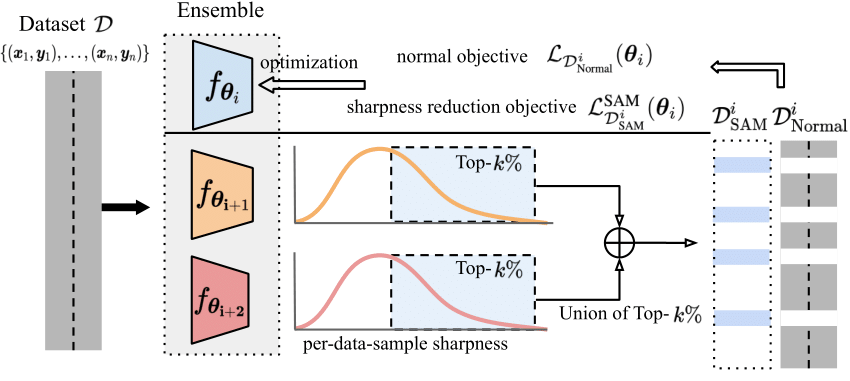

# Sharpness-diversity tradeoff: improving flat ensembles with SharpBalance

Official PyTorch implementation of SharpBalance

## Introduction

__SharpBalance__ is an ensembling method that balances the ensemble **diversity** and **sharpness** of individual ensemble members. In this work, We discover a trade-off between sharpness and diversity: minimizing the sharpness in the loss landscape tends to diminish the diversity of individual members within the ensemble, adversely affecting the ensemble's improvement. The trade-off is justified through our theoretical analysis and experiments.

<p align="center">
  
   
</p>

SharpBalance aims to achieve the optimal balance by applying SAM to a carefully selected subset of the data, while performing standard optimization on the remaining samples. 
<!-- The pipeline of the algorithm is shown below

<p align="center">
  
</p> -->

Experiments show that SharpBalance improves the overall ensembling performance and mitigates the reduced ensembling improvement caused by sharpness-diversity trade-off.

<p align="center">
  
</p>


## Setup

Installation instructions can be found in [INSTALL.md](INSTALL.md).

## Usage

### Training

* Script example of runing deep ensemble 

```
python main.py \
    --data cifar100 \
    --data_path [path to dataset] \
    --model resnet18 \
    --seed "13 17 27" \
    --save_path [path to save models]
```

* Script example of runing deep ensemble with sam

```
python main.py \
    --data cifar100 \
    --data_path [path to dataset] \
    --model resnet18 \
    --seed "13 17 27" \
    --sam True \
    --rho ${rho}
    --save_path [path to save models]
```

* Script example of runing sharpbalance

```
python main.py \
    --data cifar100 \
    --data_path [path to dataset] \
    --model resnet18 \
    --seed "13 17 27" \
    --sam True \
    --rho 0.2 \
    --flat_ratio 0.5 \
    --initial_epochs 100
    --save_path [path to save models]
```

### Evaluation of diversity and shapeness 

* Script example of measuring diversity (DER)

```
python measure_diversity.py \
    --dataset [cifar10 or cifar100 or tiny_imgnet] \
    --data_path [path to downloaded data] \
    --model resnet18 \
    --resume [path to ensemble models] \
    --mode disagreement \
    --save [path to save results]
```

* Script example of measuring diversity (variance)

```
python measure_diversity_variance.py \
    --dataset [cifar10 or cifar100 or tiny_imgnet] \
    --data_path [path to downloaded data] \
    --model resnet18 \
    --resume [path to ensemble models] \
    --mode variance_mse_c \
    --save [path to save results]
```

* Script example of measuring model sharpness

```
python measure_sharpness.py \
        --dataset [cifar10 or cifar100 or tiny_imgnet] \
        --data_path ${data_path} \
        --model resnet18 \
        --resume [path to ensemble models] \
        --mode APGD_worst \
        --save [path to save results]
```

### Simulation of theorical results

We have included the simulation code for verifications of theoretical results in the notebook [theoretical verification.ipynb](theoretical_verifications.ipynb). Feel free to try!


### Arguments usage

We provide a quick overview of the arguments:  

- `--data`: We have implemented three dataset, namely ['cifar10', 'cifar100', 'tiny_imgnet'].
- `--data_path`: Directory for loading the dataset you download.
- `--model`: The default model is 'resnet18'
- `--seed`: Three seed to initialize the model and run the training in the ensemble.
- `--save_path`: Specifies the directory where the result will be stored.
